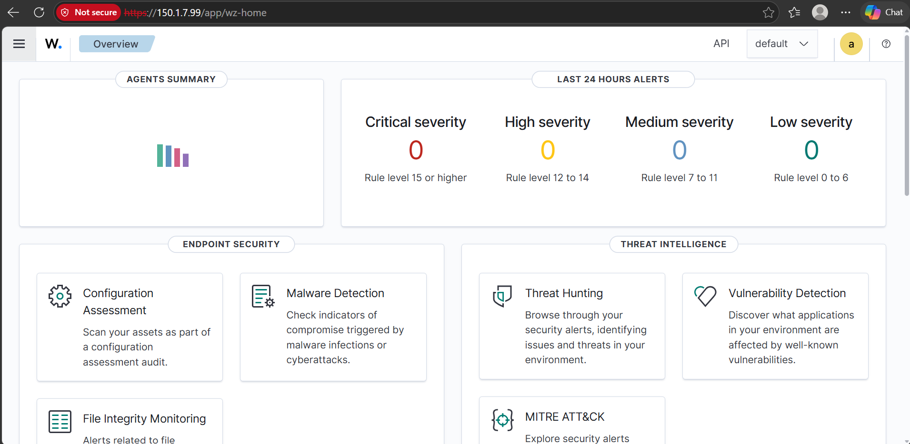

# Wazuh SIEM Home Lab

Self-practice project for blue team and SOC skills: Wazuh server
installed from scratch in a virtual home lab (OVA + Quickstart),
with a static IP so agents connect reliably.

## What's Covered
- SIEM fundamentals and career opportunities
- Wazuh architecture and core components (indexer, server, dashboard)
- Comparing installation methods
- Virtual environment best practices

## Lab Setup
| Item | Details |
|------|---------|
| Hypervisor | VMware Workstation |
| Wazuh Server | OVA deployment + Quickstart install |
| Network | Static IP on the Wazuh server |
| Dashboard | https://<WAZUH_SERVER_IP> |

## Hands-on
1. [Install via OVA](docs/03-install-ova.md)
2. [Install via Quickstart](docs/04-install-quickstart.md)
3. [Assign static IP](docs/05-static-ip-config.md)

## Screenshots

## Why Static IP?
Agents are configured with the manager's address. If the server IP
changes (DHCP), agents lose connection. A static IP avoids that.

## Roadmap
- [ ] Connect Windows/Linux agents
- [ ] Explore security alerts and rules
- [ ] File integrity monitoring and vulnerability detection
- [ ] Custom rules and decoders

## Connect
LinkedIn: <your-profile-link>

#Wazuh #SIEM #BlueTeam #SOC #HomeLab
